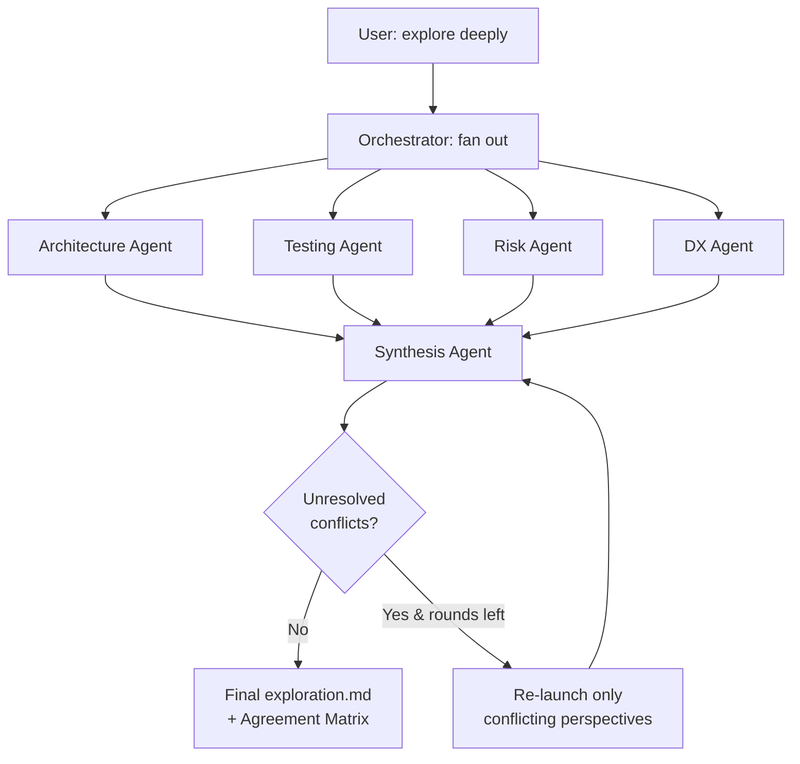
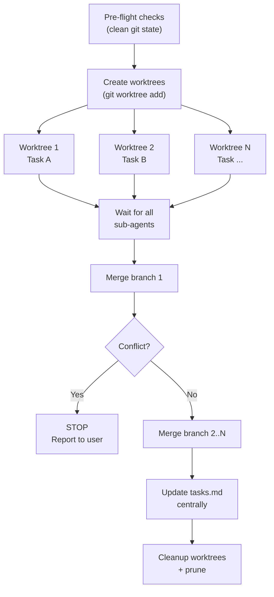
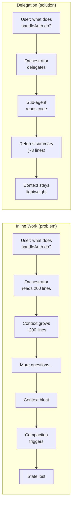
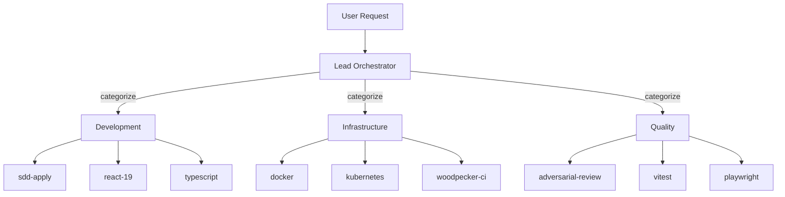

# Upstream Proposal: Features from Javi.Dots for agent-teams-lite

## Context

[Javi.Dots](https://github.com/JNZader/Javi.Dots) is a fork and active consumer of [agent-teams-lite v3.3.6](https://github.com/Gentleman-Programming/agent-teams-lite). Over the course of daily development on a Go TUI project with 70+ available skills, several SDD orchestration features were added to address real workflow pain points that became apparent during sustained, multi-session use of the framework.

The core pain points that motivated these proposals:

1. **Single-viewpoint exploration** — The explore phase produces one perspective, so risks and gaps are only discovered downstream during implementation or code review, when they're expensive to fix.
2. **Slow sequential task execution** — Independent tasks run one after another even when they touch different files, making large changes take 4x longer than necessary.
3. **Context bloat from inline work** — The orchestrator reads code or writes specs directly instead of delegating, consuming always-loaded context tokens that accumulate across the session and eventually trigger compaction, losing state.
4. **Sub-agent capability confusion** — Sub-agents inherit the orchestrator's "NEVER read/write code" rules from the shared prompt context and refuse to do the work they were specifically launched to perform.

These proposals are **backward-compatible additions** that benefit the entire ATL ecosystem. None modify existing behavior unless explicitly opted into. Every feature defaults to the current ATL behavior — users must actively enable new functionality through config flags or explicit trigger phrases. They are organized by priority:

- **HIGH** (7 items) -- Generic, tested in production, ready to merge with minimal adaptation. These address problems that any ATL user will encounter at scale.
- **MEDIUM** (4 items) -- Valuable patterns that need generalization before upstreaming. These work well in Javi.Dots but contain project-specific assumptions that should be abstracted.

---

## HIGH Priority Proposals

### 1. Multi-Perspective Explore

**Problem.** A single `sdd-explore` agent produces one viewpoint. In practice, this misses risks that a security-focused lens would catch, testing gaps that a QA lens would find, or DX friction that an ergonomics lens would surface. The user only discovers these blind spots downstream, during implementation or review.

Consider a concrete scenario: You're exploring a change to add WebSocket support to an existing REST API. A single explore agent might focus on the architecture (where the WS handler lives, how it integrates with existing routes) and produce a solid exploration. But it never considers:
- **Testing**: How do you write E2E tests for persistent connections? What about connection drop scenarios?
- **Risk**: Does this break existing clients that expect pure REST? What happens under load with thousands of open connections?
- **DX**: Will other developers understand the new event subscription pattern? Is the API intuitive?

These gaps surface weeks later as bugs, rework, or confused PR reviews. The cost of fixing a missed risk during exploration is a sentence in a document; the cost of fixing it during implementation is a rewrite.

**Solution.** The orchestrator fans out N parallel `sdd-explore` sub-agents (default: 4), each constrained to a single analytical perspective. A synthesis agent then merges the results into one comprehensive `exploration.md` with an Agreement Matrix showing cross-perspective alignment.

The key insight is that exploration quality scales better with diverse viewpoints than with a single agent thinking longer. Four agents spending 30 seconds each from different angles produce better coverage than one agent spending 2 minutes from one angle. This mirrors how real engineering teams work — architecture review, security review, and QA review happen in parallel by different specialists, not sequentially by one generalist.

The fan-out, synthesis, and multi-round iteration flow:



**Changes required:**

1. `sdd-explore/SKILL.md` -- Add an optional `perspective` input and a `### Perspective Mode` section. When `perspective` is provided, the agent focuses its entire exploration through that lens (e.g., a `testing` perspective only analyzes testability, coverage gaps, and testing strategies — it ignores architecture decisions). When absent, behavior is unchanged, preserving full backward compatibility.

2. Orchestrator prompt -- Add a `### Multi-Perspective Explore` section covering trigger conditions, fan-out dispatch, synthesis dispatch, and multi-round iteration. This section teaches the orchestrator WHEN to fan out (only on explicit triggers), HOW to dispatch (all Task calls in one message for parallel execution), and HOW to synthesize (dedicated synthesis agent, never inline).

**Default perspectives** (customizable via config — any string name is valid, not limited to these four):

| Perspective | Focus |
|-------------|-------|
| `architecture` | Patterns, abstractions, integration points, coupling, extensibility |
| `testing` | Testability, coverage gaps, edge cases, testing strategy |
| `risk` | Security, breaking changes, backwards compatibility, failure modes |
| `dx` | Developer experience, onboarding friction, documentation needs, API ergonomics |

**Key innovation -- Agreement Matrix.** The synthesis agent produces a structured table showing where perspectives agree and disagree. This is the most valuable output of multi-perspective explore: instead of a single "recommended approach" that hides uncertainty, you get a visual map of confidence levels across findings. The user can immediately see which decisions are safe (all perspectives agree) and which need discussion (perspectives conflict):

```markdown
### Agreement Matrix
| Finding | Architecture | Testing | Risk | DX | Confidence |
|---------|:-----------:|:-------:|:----:|:--:|:----------:|
| Use pattern X | Y | Y | ! | Y | High |
| Approach Y | Y | N | Y | N | Low -- needs resolution |
| Migration risk Z | - | - | Y | - | Single perspective -- unvalidated |
```

Column markers: Y = agrees, N = disagrees, ! = partial/conditional, - = did not analyze. These simplified markers are intentional — they render cleanly in any markdown viewer and are unambiguous at a glance.

Confidence values: **High** (all agree), **Medium** (majority agree), **Low -- needs resolution** (split — the user should make a deliberate decision here), **Single perspective -- unvalidated** (only one perspective raised it — could be insightful or could be noise, worth a second look).

**Multi-round iteration.** Configurable via `explore.rounds` (default: 1, max: 3). After each round, the synthesis agent flags "NEEDS FURTHER ANALYSIS" items — these are findings where perspectives directly contradict each other (e.g., Architecture says "use pattern X" but Testing says "pattern X is untestable"). Only the perspectives with unresolved findings re-launch in the next round, receiving the prior synthesis as additional context so they can specifically address the conflict rather than repeating their entire analysis. If a round produces zero unresolved items, iteration stops early — no wasted tokens on converged results. In practice, most explorations converge after 1-2 rounds; 3 rounds is a safety cap for genuinely complex topics.

**Fan-out dispatch template.** All Task calls must be emitted in a single message to ensure parallel execution — if the orchestrator sends them in separate messages, they run sequentially and lose the speed benefit:

```
Task(
  description: 'explore ({perspective_name}) for {change-name}',
  prompt: 'You are an SDD explore sub-agent.
  Read the skill file at sdd-explore/SKILL.md FIRST, then follow its instructions.

  Perspective: {perspective_name}
  Focus your ENTIRE exploration through the {perspective_name} lens.

  CONTEXT:
  - Project: {project path}
  - Change: {change-name}
  - Topic: {topic}
  - Artifact store mode: {mode}

  IMPORTANT: Do NOT persist exploration.md -- the synthesis agent will
  produce the final artifact.
  Return structured output with: status, executive_summary, perspective,
  artifacts, next_recommended, risks.'
)
```

**Config schema.** The config section is optional — when absent, all defaults apply (`mode: standard`, default perspectives, 1 round). Users only need to add this section when they want to customize behavior:

```yaml
explore:
  mode: standard  # standard | deep
  perspectives:    # optional override (max 4), any string names accepted
    - architecture
    - testing
    - risk
    - dx
  rounds: 1        # iteration rounds, max 3
```

Note that `perspectives` accepts any string names, not just the four defaults. A security-focused team might use `[security, compliance, architecture, risk]`. A frontend team might use `[ux, accessibility, performance, testing]`. The orchestrator passes the perspective name to the sub-agent's prompt without validation, so any descriptive name works.

**Backward compatible.** Default is `mode: standard` (single-agent explore, identical to current ATL behavior). Multi-perspective activates only when the user explicitly says "explore deeply", "multi-perspective", or sets `explore.mode: deep` in config. Users who never touch this config see zero behavior change.

---

### 2. Parallel Apply with Worktrees

**Problem.** Sequential task execution is slow when tasks are independent. A change with 8 tasks where 4 are parallelizable takes 4x longer than necessary.

To make this concrete: imagine an SDD change with these tasks:
- Task 1: Add a new database model (`models/widget.go`)
- Task 2: Create API handler (`handlers/widget.go`)
- Task 3: Update documentation (`docs/api.md`)
- Task 4: Add E2E test (`tests/widget_test.go`)

Tasks 1 and 2 might depend on each other, but task 3 (docs) and task 4 (tests) are completely independent — they touch different files and have no logical dependency. With sequential apply, you wait for each to finish before starting the next. With parallel apply, tasks 3 and 4 run simultaneously in isolated git worktrees, cutting wall-clock time roughly in half for those tasks.

**Solution.** The orchestrator creates isolated git worktrees per task, launches sub-agents in parallel (one per worktree), and merges branches sequentially after completion. Git worktrees are the ideal isolation mechanism here because each worktree has its own working directory and index, so sub-agents cannot step on each other's files. Unlike separate clones, worktrees share the same `.git` directory, making creation and cleanup instant.

**Changes required:**

1. `sdd-apply/SKILL.md` -- Add an optional `workdir` input and a `### Worktree Mode` section. When `workdir` is provided, the sub-agent works in that directory instead of the project root. Critically, it also skips `tasks.md` updates — this prevents merge conflicts on the shared state file. The orchestrator handles `tasks.md` updates centrally after all branches are merged.

2. Orchestrator prompt -- Add a `### Parallel Apply with Worktrees` section covering the full lifecycle: pre-flight checks, worktree creation, parallel dispatch, sequential merge, and cleanup.

**Worktree lifecycle.** Each step is designed to be safe and reversible — if anything fails, the user can inspect the state and decide how to proceed:

The create → dispatch → merge → cleanup lifecycle:



```
For each independent task (max: apply.max_worktrees):

1. CREATE worktree:
   git worktree add .worktrees/sdd-{change}-task-{id} \
     -b sdd/{change}/task-{id}

2. DISPATCH sub-agent with workdir set to the worktree path.
   All Task calls in a SINGLE message (parallel execution).

3. Wait for ALL sub-agents to complete.

4. MERGE each branch sequentially:
   git merge --no-ff sdd/{change}/task-{id} \
     -m "merge: task {id} from parallel apply"
   - On conflict: STOP immediately. Report conflicting files.
     Do NOT auto-resolve. Leave unmerged branches intact.
   - On success: continue to next branch.

5. UPDATE tasks.md centrally from sub-agent completion reports.

6. CLEANUP:
   git worktree remove .worktrees/sdd-{change}-task-{id}
   git branch -d sdd/{change}/task-{id}
   git worktree prune
```

**Safety model.** Parallel execution introduces risk — this safety model is designed to ensure the user never loses work or ends up in an irrecoverable git state:

- **Pre-flight checks**: Clean git state (`git status --porcelain` empty), no leftover worktrees, no in-progress merge/rebase. Abort if any check fails. This prevents the common mistake of starting parallel work on top of uncommitted changes.
- **Sequential merge with `--no-ff`**: Preserves branch history, makes rollback easy. The `--no-ff` flag creates merge commits even when fast-forward is possible, so each task's contribution is visible in `git log --oneline --graph` and can be reverted individually with `git revert -m 1`.
- **Stop on first conflict**: Never auto-resolve. Report conflicting files and which task caused it. Leave unmerged branches intact for inspection. This is the most important safety guarantee — auto-resolving merge conflicts in AI-generated code is a recipe for subtle bugs.
- **Partial failure**: Merge successful branches first (in order), report failures with details, leave failed worktrees for user inspection. Never auto-retry. The user can inspect the failed worktree, fix the issue manually, and re-run just the failed task.

**Cap rule.** If tasks > `max_worktrees`, batch in waves. First wave runs N tasks in parallel, waits for completion and merge, then dispatches the next wave. This prevents resource exhaustion (each worktree is a full working directory copy) and keeps merge conflicts manageable by limiting the number of concurrent branches.

**Config schema.** The default of 4 concurrent worktrees was chosen empirically — it balances parallelism gains against merge complexity. More than 4 concurrent branches significantly increases the chance of merge conflicts:

```yaml
apply:
  parallel: false     # true to enable parallel apply
  max_worktrees: 4    # cap on concurrent worktrees
```

**Backward compatible.** Default is `parallel: false` (sequential apply, identical to current ATL behavior). Parallel mode activates only on explicit opt-in via config or keywords like "apply in parallel". Users who never touch this config see zero behavior change.

---

### 3. Delegation Rules Scope Extension

**Problem.** Current delegation rules are scoped to SDD workflows. When the user asks a non-SDD question that requires code reading or analysis, the orchestrator does the work inline. This bloats the always-loaded context, accelerates compaction, and causes state loss in long sessions.

Here's the failure scenario in practice: The user asks "what does the `handleAuth` function do?" — a perfectly reasonable question outside any SDD workflow. The orchestrator reads the file inline (200+ lines of code now in the always-loaded context), summarizes it, and moves on. Three more such questions later, the orchestrator's context has grown by 800+ lines of source code that will persist for the entire conversation. When compaction eventually triggers, the system discards earlier context to fit — and that discarded context might include SDD state, task progress, or previous decisions the user made. The user then asks "continue with the next task" and the orchestrator has no idea what task they're referring to.

The fix is simple: delegate ALL code-reading tasks to sub-agents, not just SDD tasks. Sub-agents get fresh context, do the work, and return a summary. The source code never enters the orchestrator's always-loaded context.

How inline work causes context bloat vs. how delegation preserves it:



**Solution.** Make delegation rules unconditionally active with an explicit scope declaration:

```markdown
### Delegation Rules (ALWAYS ACTIVE)

These rules apply to EVERY user request, not just SDD workflows.

1. **NEVER do real work inline.** If a task involves reading code, writing code,
   analyzing architecture, running tests, or any implementation -- delegate it
   to a sub-agent via Task.
2. **You are allowed to:** answer short questions, coordinate sub-agents, show
   summaries, ask the user for decisions, and track state. That is it.
```

**Rationale** (included in the prompt text for self-reinforcement — the orchestrator reads this about itself, which reinforces the behavior):

> "You are always-loaded context. Every token you consume is context that survives for the ENTIRE conversation. If you do heavy work inline, you bloat the context, trigger compaction, and lose state. Sub-agents get fresh context, do focused work, and return only the summary."

This rationale is deliberately embedded in the prompt rather than being in a comment or separate document. The orchestrator needs to understand WHY it delegates, not just THAT it should delegate. When the LLM understands the mechanism (context bloat → compaction → state loss), it's far more consistent about following the rule.

**Task Escalation table** (aids routing decisions — gives the orchestrator clear decision rules instead of judgment calls):

| User describes... | Orchestrator does... |
|-------------------|---------------------|
| Simple question | Answer briefly if known, otherwise delegate |
| Small task (single file) | Delegate to general sub-agent |
| Substantial feature/refactor | Suggest SDD: `/sdd:new {name}` |

**Backward compatible.** Strengthens existing delegation behavior without removing any capability. The orchestrator can still answer short factual questions inline — it just stops doing heavy work (code reading, analysis, implementation) in its own context. This is a tightening of existing guidance, not a new restriction.

---

### 4. Sub-Agent Capabilities Clarification

**Problem.** Sub-agents launched by the orchestrator sometimes inherit the orchestrator's "NEVER read/write code" rules and self-restrict, refusing to do the work they were specifically delegated.

This is a subtle but infuriating bug. Here's what happens: The orchestrator prompt says "NEVER read source code directly — sub-agents do that." When the orchestrator launches a sub-agent via Task, parts of the orchestrator prompt may be visible in the sub-agent's context window (depending on the runtime). The sub-agent reads "NEVER read source code" and interprets it as a rule for itself. It then either:
1. **Refuses outright**: "I cannot read source code per the delegation rules" — the user is stuck.
2. **Cascading delegation**: The sub-agent tries to launch ANOTHER sub-agent to read the code, which may hit the same problem, creating an infinite delegation loop.

Both outcomes are silent failures — the user gets a polite refusal or a timeout, with no indication that the problem is a prompt ambiguity.

**Solution.** Add an explicit clarification block immediately after the Orchestrator Rules section. Placement matters — it must appear right after the restriction rules so the LLM processes it as a direct qualifier:

```markdown
> **Note:** These rules define what the ORCHESTRATOR does. Sub-agents are NOT
> bound by these -- they are full-capability agents that read code, write code,
> run tests, and use ANY of the user's installed skills.
```

**Tiny diff, critical impact.** This is a single paragraph addition, but it eliminates the most common source of sub-agent failure in practice. The explicit "Sub-agents are NOT bound by these" creates an unambiguous scope boundary that the LLM consistently respects.

**Backward compatible.** Additive clarification only. No behavior change for orchestrators that already delegate correctly.

---

### 5. Self-Check Delegation Checklist

**Problem.** The current delegation guidance is prose-style ("delegate heavy work to sub-agents"). In practice, the orchestrator frequently decides that a "quick look" at a file is fine, leading to context bloat.

The failure mode is always the same: the orchestrator encounters a task that feels small enough to do inline. "Let me just check this one file." "I'll just write this quick config." Each individual decision is reasonable, but they accumulate. Five "quick looks" is 500+ lines of source code permanently in the orchestrator's context. The prose-style guidance leaves room for this judgment call every time, and the LLM consistently leans toward doing the work itself.

**Solution.** Replace prose guidance with a concrete, binary checklist that the orchestrator evaluates before every response. The checklist format is deliberate — LLMs are much more consistent at following explicit yes/no decision trees than interpreting qualitative guidance like "heavy work":

```markdown
3. **Self-check before every response:**
   - Am I about to read source code? -> DELEGATE
   - Am I about to write/edit code? -> DELEGATE
   - Am I about to analyze architecture? -> DELEGATE
   - Am I about to run tests/builds? -> DELEGATE
   - Am I about to write specs/proposals/designs? -> DELEGATE
   If none apply -> safe to respond inline.
```

The binary yes/no format eliminates ambiguity. There is no "just a quick look" escape hatch. Each check is deliberately broad — "Am I about to read source code?" covers everything from reading one function to scanning an entire module. This is intentional: the cost of one unnecessary delegation is a few seconds; the cost of one unnecessary inline read is permanent context bloat.

**Backward compatible.** Same intent as existing guidance, more actionable format. This is a reformatting of existing rules, not new restrictions.

---

### 6. Example Hook Scripts

**Problem.** ATL ships skills but no example hooks. Users familiar with skills may not realize that hooks (auto-triggered scripts on tool use) are available, or what patterns are possible.

Skills and hooks serve different purposes but complement each other: skills provide on-demand context that the agent reads when relevant, while hooks are auto-triggered scripts that run every time a specific tool is used. For example, a skill tells the agent "use PEP 8 style in Python files," but a hook can automatically CHECK that the agent followed through after every file edit. Without example hooks, users don't discover this capability and miss an entire category of automation.

**Solution.** Ship two minimal example hooks in a `hooks/` directory. These are intentionally simple (under 20 lines each) to serve as templates rather than production tools. Each demonstrates a different hook trigger point:

**`hooks/comment-check.sh`** -- PostToolUse hook: runs after every Write or Edit tool invocation. It warns on bare TODO/FIXME/HACK comments without explanatory context, encouraging the pattern `TODO(author): reason` instead of orphaned `TODO` markers that nobody ever resolves:

```bash
#!/bin/bash
# PostToolUse hook: advisory warning on bare TODO/FIXME/HACK comments
# Exit 0 always (advisory only, never blocks)

if [ "$TOOL_NAME" = "Write" ] || [ "$TOOL_NAME" = "Edit" ]; then
  FILE="$TOOL_INPUT_filePath"
  if grep -qnE '(TODO|FIXME|HACK)\s*$' "$FILE" 2>/dev/null; then
    echo "Warning: Found TODO/FIXME/HACK without context in $FILE"
    echo "Consider adding a description: TODO(author): reason"
  fi
fi
exit 0
```

**`hooks/todo-tracker.sh`** -- Stop hook: runs when the agent session ends. It reminds the user about uncommitted changes so they don't lose work between sessions:

```bash
#!/bin/bash
# Stop hook: advisory reminder about uncommitted changes
# Exit 0 always (advisory only, never blocks)

UNCOMMITTED=$(git status --porcelain 2>/dev/null | wc -l)
if [ "$UNCOMMITTED" -gt 0 ]; then
  echo "Reminder: $UNCOMMITTED uncommitted change(s) in working tree."
  echo "Run 'git status' to review before closing."
fi
exit 0
```

Both scripts share important design properties:
- **Under 20 lines** — easy to read and understand as templates
- **Advisory-only** (always exit 0) — they never block the agent's work, only surface information
- **Zero dependencies** — standard bash, grep, and git; nothing to install
- **Demonstrate different trigger points** — PostToolUse (runs after a specific tool) and Stop (runs on session end)

Users can fork these as starting points for their own hooks: linting after edits, running type-checks before commits, tracking time spent per task, etc.

**Backward compatible.** Additive content only. Users opt in by configuring hooks in their agent settings. The hooks directory ships as examples — they are not auto-enabled.

---

### 7. Skill Version Tracking Table

**Problem.** When users customize skills or run multiple ATL versions across projects, there is no centralized view of which skill versions are installed or which have been modified from upstream.

This causes real confusion in multi-project setups. Consider a user working on three projects, each installed from a different ATL version. Project A has `sdd-apply` v2.0, Project B has `sdd-apply` v2.1 (locally modified to add worktree support), and Project C has the unmodified ATL v3.3.6 version. When something breaks in Project C's apply phase, the user's first instinct is to compare with the working version in Project B — but they have no way to know that Project B's `sdd-apply` has been modified. They waste time debugging a "regression" that is actually a missing customization.

**Solution.** Add a `### Skill Versions` table to the orchestrator config or AGENTS.md. This provides a single-glance view of the skill inventory — what's installed, what version, and whether it's been modified from upstream:

```markdown
### Skill Versions

| Skill | Version | Upstream |
|-------|---------|----------|
| sdd-init | 2.0 | agent-teams-lite v3.3.6 |
| sdd-explore | 2.1 | agent-teams-lite v3.3.6 + custom |
| sdd-apply | 2.1 | agent-teams-lite v3.3.6 + custom |
| react-19 | 1.0 | agent-teams-lite v3.3.6 |
| adversarial-review | 1.0 | agent-teams-lite v3.3.6 |
```

The `Upstream` column is the key differentiator — it tells you at a glance whether a skill is stock ATL or has been customized. Skills marked `+ custom` have local modifications that need manual review during upgrades.

This helps with:
- **Debugging version mismatches** — "Why does apply work in Project A but not Project B?" Check the table: different versions.
- **Tracking local modifications** — The `+ custom` suffix makes modified skills immediately visible, preventing accidental overwrites during upgrades.
- **Planning upgrades** — When ATL v3.4 ships, scan the table to identify which skills need diffing against the new upstream versions.
- **Auditing capabilities** — Know exactly what skills the AI assistant has access to in each project, useful for security reviews or onboarding new team members.

**Backward compatible.** Additive metadata. Can be auto-generated by the ATL installer during setup, making it zero-effort for users. The table is informational — the orchestrator doesn't read it for decision-making, so an incomplete or outdated table causes no failures.

---

## MEDIUM Priority Proposals

These patterns proved valuable in daily Javi.Dots development but need generalization before upstreaming. Each contains project-specific assumptions (hardcoded categories, language-specific triggers, project-specific conventions) that should be abstracted into configurable patterns. The core ideas are sound — the implementation details need to become parameterizable.

### 8. Identity Inheritance

**Problem.** When users define a custom personality/tone in their prompt file (mentor, pair programmer, etc.), activating SDD mode resets the agent to a generic orchestrator voice. This creates a jarring UX discontinuity.

For example, a user has configured their agent as a patient mentor that explains decisions in detail and uses encouraging language. They've been working this way for an hour — the agent feels familiar and productive. Then they run `/sdd:new add-auth` and suddenly the agent switches to a terse, formal orchestrator voice: "Launching sub-agent for proposal phase. Awaiting completion." The personality they carefully configured is gone. When SDD finishes and they resume normal work, the personality may or may not return, depending on how much context was consumed during the SDD workflow.

This matters because many users invest significant effort in tuning their agent's communication style. Losing that tuning when switching to SDD mode makes SDD feel like a separate, less pleasant tool — discouraging adoption.

**Solution.** Add an `### Identity Inheritance` section to the orchestrator prompt. The key insight is framing SDD as an "overlay" rather than a mode switch — the orchestrator gains new capabilities (delegation, state tracking) without replacing its existing personality:

```markdown
### Identity Inheritance
- Keep the SAME identity, tone, and teaching style defined elsewhere
  in your prompt file.
- Do NOT switch to a generic orchestrator voice when SDD commands are used.
- Apply SDD rules as an overlay, not a personality replacement.
```

**Needs generalization.** The Javi.Dots implementation references project-specific mentoring behavior (e.g., "keep coaching behavior: explain the WHY, validate assumptions"). The upstream version should use generic language that works for ANY identity the user has defined — mentor, pair programmer, concise expert, or anything else.

---

### 9. Natural Language SDD Triggers

**Problem.** Users must memorize exact `/sdd:` command syntax. New users do not know these commands exist and describe their intent in natural language.

The discoverability problem is real: a new user says "I want to plan out this authentication feature before coding it" — which is exactly what SDD is designed for. But because they don't know the `/sdd:new` command exists, they get a generic response instead of a structured exploration → proposal → spec workflow. The SDD commands are powerful but invisible to users who haven't read the documentation.

**Solution.** Document common trigger phrases that the orchestrator recognizes and maps to SDD commands. The orchestrator detects intent from natural language and SUGGESTS the appropriate command rather than auto-executing it — the user still confirms, preserving control:

| User says... | Orchestrator suggests... |
|-------------|------------------------|
| "new change", "start a feature", "plan this" | `/sdd:new {name}` |
| "implement", "apply the tasks", "start coding" | `/sdd:apply` |
| "verify the implementation", "check if it matches spec" | `/sdd:verify` |
| "explore this idea", "think through this" | `/sdd:explore {topic}` |

The orchestrator detects intent and suggests the appropriate command rather than requiring exact syntax. The user still confirms before the command executes — this prevents false positives where the user says "let me explore this idea" casually but doesn't want a full SDD exploration.

**Needs generalization.** The Javi.Dots implementation includes Spanish-language triggers (e.g., "explorar en profundidad", "aplicar los cambios"). The upstream version should define the English trigger pattern and provide a config mechanism for users to add triggers in their own language:

---

### 10. Domain Routing (Two-Tier Delegation)

**Problem.** With many available skills (70+ in Javi.Dots), the orchestrator struggles to pick the right specialist for a given task. It either picks the wrong agent or spends tokens evaluating all options.

The scaling problem becomes apparent around 20+ skills. When the orchestrator has 70 skills to choose from and the user says "set up Docker for this project," the orchestrator must evaluate whether this is a `docker-containers` task, a `devops-infra` task, a `kubernetes` task, or a `woodpecker-ci` task. It spends tokens reading skill descriptions, sometimes picks the wrong one, and occasionally invents a skill name that doesn't exist. The more skills available, the worse the selection accuracy becomes.

**Solution.** Introduce domain orchestrators as an intermediate routing layer. Instead of the lead orchestrator choosing from 70 skills directly, it chooses from ~5 domains, then a domain-specific orchestrator (which only knows its own skills) makes the final selection:

```
User request
  -> Lead Orchestrator (lightweight routing)
    -> Domain Orchestrator (Development | Infrastructure | Quality | ...)
      -> Specialist Agent (sdd-apply | docker | vitest | ...)
```

The two-tier routing hierarchy in action:



The lead orchestrator routes to a domain based on the request category. The domain orchestrator knows its specialists and picks the right one. This reduces the lead orchestrator's decision space from N agents to ~5 domains — a categorization task (what kind of problem is this?) rather than a selection task (which of 70 tools fits best?).

**Needs generalization.** The Javi.Dots implementation hardcodes domain categories that reflect its specific skill inventory. The upstream version should make domains configurable so any team can define their own routing taxonomy:

The config below shows a sample domain structure. Each domain lists its skills explicitly, so the lead orchestrator only needs to categorize the request (development? infrastructure? quality?) and then the domain orchestrator handles tool selection within its bounded scope:

```yaml
routing:
  domains:
    - name: development
      skills: [sdd-apply, sdd-verify, react-19, typescript]
    - name: infrastructure
      skills: [docker-containers, kubernetes, woodpecker-ci]
    - name: quality
      skills: [adversarial-review, vitest-testing, playwright-e2e]
```

---

### 11. Path-Scoped Convention Rules

**Problem.** AI assistants apply generic coding patterns regardless of the file being edited. A Python file gets JavaScript idioms if the conversation was previously about JavaScript.

In a polyglot project, this is a constant source of rework. The user spends 20 minutes working on a TypeScript React component, then switches to a Python backend file. The agent carries forward TypeScript habits: camelCase variable names instead of snake_case, arrow functions where Python needs `def`, optional chaining `?.` instead of `getattr()`. The user has to manually correct these, and the corrections themselves become part of the conversation context that could introduce further confusion.

**Solution.** Document a pattern where file path globs map to coding conventions. The AI reads the applicable conventions before editing a file matching a given pattern, ensuring consistent style regardless of conversation history:

```markdown
### Convention Rules

| Path Pattern | Conventions |
|-------------|-------------|
| `**/*.py` | PEP 8, type hints required, docstrings on public functions |
| `**/*.ts` | Strict mode, no `any`, explicit return types |
| `**/*.go` | gofmt, error wrapping with `%w`, table-driven tests |
| `**/test_*.py` | pytest fixtures, no mocking stdlib |
```

The path pattern acts as a context switch signal. When the agent opens `handlers/auth.go`, it checks the convention table, finds the `**/*.go` rule, and applies Go-specific conventions (gofmt formatting, error wrapping with `%w`, table-driven tests) regardless of whether the previous file was TypeScript or Python. This replaces implicit convention inference (which is unreliable) with explicit convention declaration (which is deterministic).

**Needs generalization.** Should ship as an empty template with instructions for users to fill in their own rules, not pre-filled conventions. The table above is illustrative — each project defines their own patterns and conventions based on their tech stack and style preferences.

---

## Implementation Notes

- All HIGH priority proposals are backward-compatible with zero breaking changes to existing ATL behavior. Every feature defaults to "off" or "current behavior" and requires explicit opt-in via config flags or trigger phrases.
- Each proposal can be implemented independently — there are no cross-dependencies between them. A maintainer can merge proposal #4 (one paragraph) without touching proposal #1 (multi-perspective explore). This is intentional: the proposals are ordered by value, not by dependency.
- All features have been tested in production across the Javi.Dots development workflow (Go TUI project, multi-platform, 70+ skills) over several months of daily use. The pain points described in each problem section were encountered repeatedly, not hypothetically.
- Reference implementation is available at [Javi.Dots AGENTS.md](https://github.com/JNZader/Javi.Dots/blob/main/AGENTS.md). The Javi.Dots implementation includes all 11 proposals in their project-specific form — the HIGH priority proposals are ready to upstream with minimal adaptation, while the MEDIUM priority proposals show the pattern but need the generalizations noted in each section.

## References

- **Javi.Dots repository**: https://github.com/JNZader/Javi.Dots
- **agent-teams-lite**: https://github.com/Gentleman-Programming/agent-teams-lite
- **Multi-perspective pattern inspired by**: [make-it-heavy](https://github.com/Doriandarko/make-it-heavy), [counselors](https://github.com/aarondfrancis/counselors)
- **Worktree isolation inspired by**: [TinyAGI/fractals](https://github.com/TinyAGI/fractals), [claude-squad](https://github.com/smtg-ai/claude-squad)
- **Hook patterns inspired by**: [claude-code-config](https://github.com/jarrodwatts/claude-code-config)
